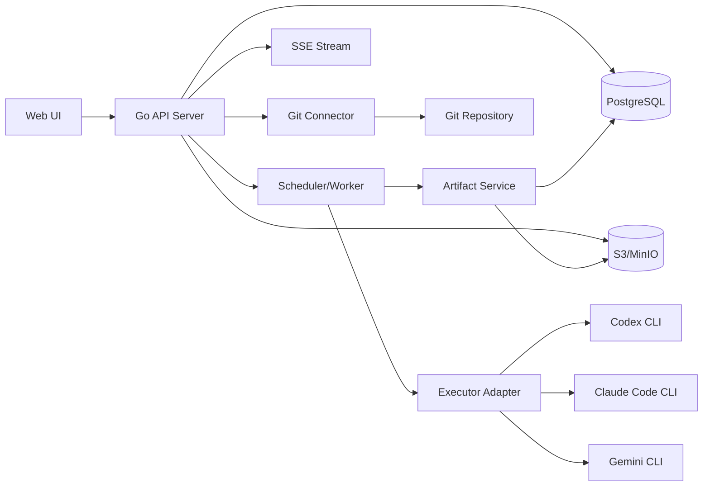

# 多 Agent 自动化开发平台最终方案（平台优先，Git 可选发布）

## 1. 方案结论

本平台的核心原则只有一句话：

**平台是项目知识与流程的主系统（source of truth），Git 只是代码上下文源和可选发布目标。**

也就是说：

- 用户创建的是**平台项目**，不是“文档跟着仓库走”的项目。
- 用户可以**新建或连接一个 Git 仓库**，用于代码读取、代码修改、测试执行、PR/合并。
- PRD、架构文档、接口契约、测试用例、Prompt、审批记录、运行日志、报告等，**默认都保存在平台内**。
- 任何文本产物都可以由用户或工作流**选择性发布到 Git**，但**不默认进 Git**。
- 后续节点读取上下文时，**优先读取平台内已固定版本的 Artifact**，必要时再读取指定 commit 的 repo 快照。
- 所有外部写操作（push、建分支、发 PR、merge、release、外部 webhook 写入）都走审批；平台内写入不审批。

---

## 2. 最终技术选型

### 2.1 前端

- React
- TypeScript
- Vite
- React Router
- Tailwind CSS
- shadcn/ui
- React Flow
- TanStack Query
- Monaco Editor
- Playwright

### 选型理由

- `Vite` 作为前端构建工具。它以原生 ESM 按需提供源码，开发时冷启动和 HMR 体验更适合复杂后台；同时插件 API 和 JavaScript API 都有完整类型支持。
- `React Flow` 作为工作流画布核心库。它本身就是面向 workflow/diagram/node-based UI 的 React 库，支持自定义节点、Minimap、Controls、Panel 等能力，适合做 DAG 画布、审批节点、条件分支、并行组。
- `shadcn/ui` 作为后台组件基础。它是“Open Code”模式，不是黑盒组件包，这对让 Codex 直接生成、修改、接管组件代码非常友好。
- `Playwright` 作为端到端测试框架。它原生支持 Chromium、WebKit、Firefox，并支持 Windows、Linux、macOS、本地与 CI，这对审批流、画布交互、运行详情页的回归测试更稳。

### 2.2 后端

- Go
- `net/http` + `chi`
- REST + OpenAPI
- SSE（实时状态推送）
- PostgreSQL
- sqlc + pgx
- OpenTelemetry
- S3 兼容对象存储（MinIO / AWS S3）
- Git CLI（本地执行）+ `git worktree`

### 选型理由

- `Go` 作为后端主语言，适合跨平台部署和 worker/scheduler 这类系统型服务。
- `PostgreSQL` 作为主数据库，适合存工作流快照、运行态变量、审计 payload、Artifact 元数据。
- `sqlc + pgx` 作为数据访问层，比重 ORM 更利于 Codex 按明确 SQL 边界生成稳定代码。
- `OpenTelemetry` 作为可观测方案，适合多节点、多执行器、多审批的链路追踪。
- 实时状态推送采用 `SSE`，因为运行状态、审批事件、Artifact 写入本质上是服务端单向推送，简单直接。
- 并行代码节点通过 `git worktree` 隔离，适合并行前端/后端/测试节点执行。

---

## 3. v1 架构原则

### 3.1 平台优先，Git 次级

- 平台保存所有流程资产与知识资产。
- Git 只保存代码，以及用户主动选择发布过去的文本资产。

### 3.2 平台内容默认不可丢

- 所有节点输出都先写入平台 Artifact Store。
- 节点对话不是长期主数据，Artifact 才是长期主数据。

### 3.3 外部副作用必须显式化

- 写 repo、发 PR、merge、release、外部通知都必须是显式节点或显式动作。
- 不允许普通文档节点“顺手”写 Git。

### 3.4 下游节点只读固定版本输入

- 下游读取的是：
  - `ArtifactVersion`
  - `RunInputSnapshot`
  - `RepoSnapshot(commit_sha)`
- 不读取上一节点的原始聊天记录。

### 3.5 v1 不做过度分布式

- v1 采用**单体 API + 内置 Scheduler + Worker**。
- 不上 Temporal。
- 不做分布式多集群。
- 不做复杂模板市场。
- 不做企业级 RBAC/ABAC。

---

## 4. 总体架构



---

## 5. 核心对象模型

### 5.1 Project

平台项目。所有配置、运行、文档资产、审批、审计都挂在项目下。

```ts
Project {
  id: string
  name: string
  description?: string
  status: "active" | "archived"
  createdAt: string
  updatedAt: string
}
```

### 5.2 RepoBinding

Git 仓库连接，不是主存储。

```ts
RepoBinding {
  id: string
  projectId: string
  provider: "github" | "gitlab" | "generic"
  remoteUrl: string
  defaultBranch: string
  authMode: "ssh_key" | "token"
  writeEnabled: boolean
  createdAt: string
}
```

### 5.3 ExecutorProfile

Agent 对应的执行器配置。

```ts
ExecutorProfile {
  id: string
  projectId: string
  name: string
  type: "codex_cli" | "claude_code" | "gemini_cli" | "custom"
  command: string
  args: string[]
  envSecretRefs: string[]
  timeoutSec: number
  maxConcurrency: number
  maxPromptChars: number
  allowRepoRead: boolean
  allowRepoWrite: boolean
  allowNetwork: boolean
}
```

### 5.4 Role

角色是职责边界，不直接绑定具体模型。

```ts
Role {
  id: string
  projectId: string
  key: string
  name: string
  prompts: {
    system?: string
    instructions?: string
  }
  permissions: {
    canReadArtifacts: boolean
    canWriteArtifacts: boolean
    canRequestPublish: boolean
    canReadRepo: boolean
    canWriteRepo: boolean
  }
}
```

### 5.5 Agent

Agent = Role + ExecutorProfile。

```ts
Agent {
  id: string
  projectId: string
  name: string
  roleId: string
  executorProfileId: string
  enabled: boolean
}
```

### 5.6 Workflow / WorkflowVersion

工作流必须版本化，运行时永远引用已发布版本。

```ts
Workflow {
  id: string
  projectId: string
  name: string
  status: "draft" | "published"
}

WorkflowVersion {
  id: string
  workflowId: string
  version: string
  graphJson: Json
  inputSchema: Json
  createdAt: string
}
```

### 5.7 Run / NodeRun

运行态对象。

```ts
Run {
  id: string
  projectId: string
  workflowVersionId: string
  status: "pending" | "running" | "paused" | "waiting_approval" | "failed" | "succeeded" | "cancelled"
  inputsJson: Json
  repoSnapshotJson?: Json
  createdBy: string
  createdAt: string
  startedAt?: string
  finishedAt?: string
}

NodeRun {
  id: string
  runId: string
  nodeKey: string
  status: "pending" | "running" | "waiting_approval" | "failed" | "succeeded" | "cancelled" | "skipped"
  attempt: number
  executorProfileId?: string
  logObjectKey?: string
  startedAt?: string
  finishedAt?: string
  errorJson?: Json
}
```

### 5.8 Artifact / ArtifactVersion

这是本平台最重要的主数据模型。

```ts
Artifact {
  id: string
  projectId: string
  kind: "prd" | "arch" | "contract" | "testcase" | "prompt" | "report" | "diff" | "note" | "other"
  title: string
  sourceOfTruth: "platform" | "repo"
  latestVersion: number
  createdAt: string
  updatedAt: string
}

ArtifactVersion {
  id: string
  artifactId: string
  version: number
  contentFormat: "md" | "yaml" | "json" | "txt" | "diff" | "pdf" | "png" | "zip"
  storageKind: "db_text" | "object_store" | "repo_ref"
  contentText?: string
  objectKey?: string
  hash: string
  sizeBytes: number
  status: "draft" | "final" | "archived"
  producedByRunId?: string
  producedByNodeKey?: string
  summary?: string
  metadataJson?: Json
  createdAt: string
}
```

### 5.9 ArtifactPublish

Artifact 发布到 Git 的显式记录。

```ts
ArtifactPublish {
  id: string
  artifactVersionId: string
  repoBindingId: string
  mode: "commit" | "branch_commit" | "pull_request"
  targetBranch: string
  targetPath: string
  commitSha?: string
  prUrl?: string
  status: "pending" | "approved" | "running" | "failed" | "succeeded" | "rejected"
  requestedBy: string
  approvedBy?: string
  createdAt: string
}
```

### 5.10 Approval / AuditEvent / SecretRef

```ts
Approval {
  id: string
  projectId: string
  runId?: string
  nodeRunId?: string
  action: "repo_write" | "open_pr" | "merge" | "release" | "external_write"
  status: "pending" | "approved" | "rejected"
  comment?: string
  createdBy: string
  decidedBy?: string
  createdAt: string
  decidedAt?: string
}

AuditEvent {
  id: string
  projectId: string
  runId?: string
  nodeRunId?: string
  type: string
  payloadJson: Json
  createdAt: string
}

SecretRef {
  id: string
  projectId: string
  name: string
  provider: "env" | "vault" | "k8s_secret"
  ref: string
  createdAt: string
}
```

---

## 6. Artifact 存储策略（平台主存储）

### 6.1 存储规则

- 小文本（建议 `<= 512 KB`）直接存 PostgreSQL。
- 大文本、二进制、日志、压缩包、图片、PDF 存 S3/MinIO。
- repo 文件引用只保存 `repoBindingId + branch/commit + path`，不把 repo 当主存储。

### 6.2 Artifact 状态

- `platform_only`：只在平台存在，默认状态
- `linked_from_repo`：从 repo 导入引用，但平台不拥有源文件
- `published_to_repo`：某个版本已成功发布到 repo
- `publish_failed`
- `archived`

### 6.3 默认读取优先级

后续任务读取上下文时，按以下顺序取输入：

1. `Run` 明确 pin 的 `ArtifactVersion`
2. 项目内同类 Artifact 的最新 `final` 版本
3. `RepoSnapshot(commit_sha)` 下的指定文件
4. workflow inputs / vars

---

## 7. 工作流执行模型

### 7.1 节点类型

v1 只实现 6 种节点：

- `task`：普通任务节点
- `condition`：条件分支
- `join`：汇聚节点
- `approval`：审批节点
- `publish`：发布到 Git
- `code_task`：挂 repo 执行代码任务

### 7.2 节点输入

每个节点输入统一由 `ContextAssembler` 生成：

```ts
NodeContext {
  runInputs: Json
  selectedArtifactVersions: ArtifactVersion[]
  repoSnapshot?: {
    repoBindingId: string
    commitSha: string
    paths?: string[]
  }
  rolePrompt: string
  nodePromptOverride?: string
}
```

### 7.3 节点输出规则

- 所有节点输出先写平台 `ArtifactVersion`
- 代码节点可额外产出：
  - `diff`
  - `test_report`
  - `repo_commit_candidate`
- 文档节点不允许直接写 Git
- 只有 `publish` 节点和显式 repo 写动作能写 Git

### 7.4 运行语义

- `depends_on`：上游成功才可执行
- `soft_depends_on`：上游失败也可继续，但会带失败标记
- `condition`：按表达式决定分支
- `join`：等待多个分支收敛
- 节点失败默认只阻断其下游，不直接取消整个 Run；工作流可配置 `fail_fast`

### 7.5 重试与幂等

- 每个 `NodeRun` 支持 `attempt`
- 重试只针对：
  - 执行器崩溃
  - 网络错误
  - 超时
- 业务失败（例如测试断言失败）不自动重试
- 幂等键：
  - `hash(workflowVersionId + nodeKey + selectedArtifactVersionIds + repoSnapshot + promptHash)`

---

## 8. Git 连接与代码执行方案

### 8.1 Git 的职责

Git 在平台里只承担 4 件事：

- 提供代码上下文
- 承载代码变更
- 作为可选文档发布目标
- 对接外部团队协作（PR / review / merge）

### 8.2 代码节点执行方式

- Run 启动时，如果工作流需要代码上下文，则生成 `RepoSnapshot`
- 每个 `code_task` 节点在独立目录执行：
  - clone / fetch 一次
  - 为节点创建独立 `git worktree`
  - checkout 到指定 branch 或 detached commit
- 节点产出：
  - patch/diff
  - test report
  - 可选 branch commit（待审批后 push）

### 8.3 文档发布方式

平台文本产物可通过以下方式发布到 Git：

- `commit_to_branch`
- `create_branch_and_commit`
- `open_pull_request`

推荐默认策略：

- 文档发布不直接写主分支
- 默认创建 `docs/<artifact-title>-<timestamp>` 分支
- 自动提交后创建 PR
- 由用户或审批流决定是否 merge

---

## 9. 执行器适配层设计

### 9.1 统一接口

```ts
interface ExecutorAdapter {
  validate(profile: ExecutorProfile): Promise<void>
  execute(input: ExecuteInput): Promise<ExecuteResult>
  cancel(nodeRunId: string): Promise<void>
}
```

### 9.2 ExecuteInput

```ts
type ExecuteInput = {
  nodeRunId: string
  workspaceDir: string
  prompt: string
  artifacts: {
    path: string
    content: string
  }[]
  repoContext?: {
    repoDir: string
    commitSha: string
  }
  limits: {
    timeoutSec: number
    maxPromptChars: number
  }
}
```

### 9.3 v1 必做适配器

- `codex_cli`
- `dummy_executor`（本地开发测试）
- 预留接口：
  - `claude_code`
  - `gemini_cli`

---

## 10. API 设计（REST）

### 10.1 项目与仓库

```http
POST   /api/projects
GET    /api/projects/:projectId
POST   /api/projects/:projectId/repo-bindings
GET    /api/projects/:projectId/repo-bindings
PATCH  /api/projects/:projectId/repo-bindings/:repoId
```

### 10.2 角色、Agent、执行器

```http
GET    /api/projects/:projectId/roles
POST   /api/projects/:projectId/roles
GET    /api/projects/:projectId/agents
POST   /api/projects/:projectId/agents
GET    /api/projects/:projectId/executor-profiles
POST   /api/projects/:projectId/executor-profiles
```

### 10.3 工作流

```http
GET    /api/projects/:projectId/workflows
POST   /api/projects/:projectId/workflows
GET    /api/projects/:projectId/workflows/:workflowId
PUT    /api/projects/:projectId/workflows/:workflowId
POST   /api/projects/:projectId/workflows/:workflowId/publish
```

### 10.4 运行

```http
POST   /api/projects/:projectId/runs
GET    /api/projects/:projectId/runs
GET    /api/projects/:projectId/runs/:runId
POST   /api/projects/:projectId/runs/:runId/cancel
POST   /api/projects/:projectId/runs/:runId/pause
POST   /api/projects/:projectId/runs/:runId/resume
GET    /api/projects/:projectId/runs/:runId/events
```

### 10.5 Artifact

```http
GET    /api/projects/:projectId/artifacts
POST   /api/projects/:projectId/artifacts
GET    /api/projects/:projectId/artifacts/:artifactId
GET    /api/projects/:projectId/artifacts/:artifactId/versions
POST   /api/projects/:projectId/artifacts/:artifactId/versions
POST   /api/projects/:projectId/artifacts/:artifactId/publish
```

### 10.6 审批与审计

```http
GET    /api/projects/:projectId/approvals
POST   /api/projects/:projectId/approvals/:approvalId/approve
POST   /api/projects/:projectId/approvals/:approvalId/reject
GET    /api/projects/:projectId/audit-events
```

---

## 11. 前端信息架构

### 11.1 页面

- `/projects`
- `/p/:projectId/overview`
- `/p/:projectId/repositories`
- `/p/:projectId/artifacts`
- `/p/:projectId/artifacts/:artifactId`
- `/p/:projectId/workflows`
- `/p/:projectId/workflows/:workflowId/canvas`
- `/p/:projectId/runs`
- `/p/:projectId/runs/:runId`
- `/p/:projectId/approvals`
- `/p/:projectId/settings`

### 11.2 关键组件

- `WorkflowCanvas`：React Flow 实现
- `NodeInspector`
- `ArtifactEditor`：Monaco + Markdown preview
- `ArtifactVersionTimeline`
- `RunGraphView`
- `NodeRunLogPanel`
- `PublishDialog`
- `ApprovalQueue`
- `RepoBindingWizard`

---

## 12. 数据库表（v1 最小集）

必须实现以下表：

- `projects`
- `repo_bindings`
- `executor_profiles`
- `roles`
- `agents`
- `workflows`
- `workflow_versions`
- `runs`
- `node_runs`
- `artifacts`
- `artifact_versions`
- `artifact_publishes`
- `approvals`
- `audit_events`
- `secret_refs`

建议索引：

- `runs(project_id, created_at desc)`
- `node_runs(run_id, node_key, attempt desc)`
- `artifact_versions(artifact_id, version desc)`
- `approvals(project_id, status, created_at desc)`
- `audit_events(project_id, created_at desc)`

---

## 13. 服务端目录结构

```text
server/
  cmd/api/
  cmd/worker/
  internal/
    app/
    domain/
    httpapi/
    workflow/
    scheduler/
    executor/
      codex/
      dummy/
      shared/
    artifact/
    publish/
    gitrepo/
    approval/
    audit/
    repo/
      queries/
      models/
    sse/
    auth/
    config/
  migrations/
  openapi/
```

---

## 14. 前端目录结构

```text
web/
  src/
    app/
    pages/
    routes/
    components/
      workflow/
      artifacts/
      runs/
      approvals/
      repositories/
      ui/
    hooks/
    services/
    types/
    stores/
    lib/
```

---

## 15. 运行流程

### 15.1 新建项目

1. 创建平台项目
2. 可选连接 Git 仓库
3. 创建角色、执行器、Agent
4. 创建并发布 WorkflowVersion

### 15.2 发起运行

1. 用户选择工作流版本
2. 填入 inputs
3. 平台固定：
   - workflowVersion
   - selectedArtifactVersions
   - repoSnapshot（如果配置了 repo）
4. 创建 Run

### 15.3 节点执行

1. Scheduler 找到就绪节点
2. ContextAssembler 组装输入
3. ExecutorAdapter 调模型/CLI
4. 输出写入 ArtifactVersion
5. 如有外部动作则创建 Approval
6. 通过 SSE 推送状态更新

### 15.4 发布到 Git

1. 用户在 Artifact 页面点“发布到 Git”
2. 选择：
   - repo
   - branch
   - path
   - mode（commit/PR）
3. 创建 `ArtifactPublish`
4. 如策略要求，则进入审批
5. Worker 执行 git 操作
6. 写回 commitSha / prUrl

---

## 16. v1 必做功能

### P0

- 项目管理
- RepoBinding
- Role / Agent / ExecutorProfile 管理
- Workflow 草稿编辑 + 发布版本
- DAG 调度
- Run / NodeRun
- Artifact / ArtifactVersion
- Codex CLI 执行器
- SSE 运行状态流
- 审批中心
- 发布到 Git
- 审计日志

### P1

- `condition` / `join`
- Artifact 版本 diff
- 从 repo 导入文件为平台 Artifact
- 多执行器支持（Claude / Gemini）
- 更细粒度权限

### 不做

- 模板市场
- 分布式 worker 集群
- 向量数据库 / RAG
- 双向自动 Git 同步
- 企业级 ABAC
- 多租户 SaaS 计费系统

---

## 17. 里程碑

### Week 1

- 后端骨架
- DB migration
- Project / RepoBinding / Artifact / Workflow CRUD
- 前端基础页面

### Week 2

- Scheduler / Run / NodeRun
- Codex CLI adapter
- SSE
- Run detail 页面

### Week 3

- ArtifactVersion
- Publish to Git
- Approval flow
- AuditEvent

### Week 4

- Workflow canvas
- condition / join
- Artifact editor
- E2E 测试
- 部署脚本

---

## 18. 验收标准

满足以下条件即视为 v1 可交付：

1. 用户可以创建平台项目，并连接一个 Git 仓库。
2. 用户可以在平台里创建 PRD/架构文档/测试用例，且这些内容不依赖 Git。
3. 用户可以创建工作流并运行。
4. 节点可以读取平台内 Artifact 和 repo 快照。
5. 代码节点可以在独立 `git worktree` 中执行。
6. 节点输出默认写回平台 Artifact Store。
7. 用户可以把任意文本 Artifact 发布到 Git。
8. 外部写动作必须经过审批。
9. Run 详情页可以实时看到节点状态、日志、产物。
10. 审计日志可以追溯到：
   - 谁发起
   - 谁审批
   - 哪个节点产出什么
   - 哪次发布写到了哪个 repo/path/commit

---

## 19. 给 Codex 的实现要求

请严格按以下要求开发：

1. **先做 v1 单体，不要拆微服务。**
2. **平台 Artifact Store 是主系统，Git 不是主系统。**
3. **所有节点输出先入平台，再决定是否发布到 Git。**
4. **工作流运行必须引用已发布的 WorkflowVersion。**
5. **下游节点必须读取固定版本 Artifact，而不是读取“最新聊天记录”。**
6. **外部写动作统一走 Approval。**
7. **不要引入 Temporal、Kafka、向量数据库、复杂插件市场。**
8. **后端必须使用 Go；前端必须使用 React + TypeScript + Vite。**
9. **数据库访问必须使用 sqlc + pgx。**
10. **必须提供 OpenAPI、数据库迁移、seed 数据、基础 Playwright 回归测试。**

---

## 20. 一句话版产品定义

**这是一个“以平台为主、Git 为辅”的多 Agent 自动化开发平台：平台负责流程、知识资产、审批与审计，Git 负责代码与可选发布。**
