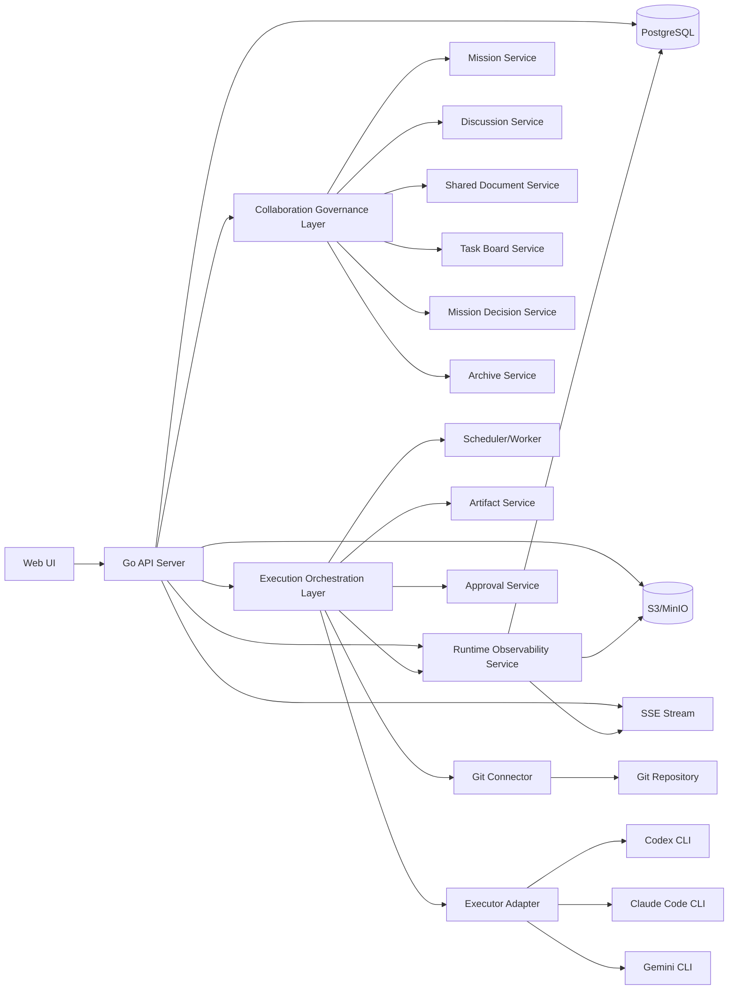

# 多 Agent 自动化开发平台 v2 协作治理方案

## 1. 文档定位

本文是对 [multi-agent-platform-final-plan.md](./multi-agent-platform-final-plan.md) 与 [multi-agent-platform-v1.1-method.md](./multi-agent-platform-v1.1-method.md) 的独立升级方案。

v1 与 v1.1 已经把下面几件事定义得比较清楚：

- 平台是知识与流程主系统。
- Git 是代码上下文源和可选发布目标。
- 外部副作用必须进入审批链。
- 代码中间态不能只靠 Git 传递。

但它们仍然主要围绕“工作流节点如何执行”来设计，没有把“一个管理员 Agent 组织多个 Agent 讨论、收敛、分工、接力、复核、结项”作为一等模型。

v2 的目标不是简单增加并行节点，而是把平台升级成一个真正的多 Agent 协作治理系统。核心变化有四点：

1. 最外层业务对象从 `Run` 升级为 `Mission`。
2. 每个 `Mission` 都由一个管理员 Agent 负责治理，而不是由普通执行节点自行结束。
3. 多个 Agent 的讨论、统一方案文档、任务领取、任务接力、复核与结项都成为平台内显式对象。
4. 所有文档与代码中间态统一托管，最终由平台归档到 S3。

---

## 2. v2 核心结论

v2 采用下面 10 条核心结论：

1. 平台编排的对象不再只是 DAG 节点，而是“管理员 Agent 主导的 Agent 团队协作”。
2. 一个需求、项目事项或问题单必须先落为 `Mission`，再在 `Mission` 下进入讨论、规划、开发、测试、评审、发布、结项等阶段。
3. 每个 `Mission` 必须存在且只存在一个管理员 Agent 作为协作治理责任人。
4. 多个 Agent 在执行前可以进入同一个 `DiscussionSession`，充分讨论后生成统一方案与统一文档。
5. 文档统一通过 `SharedDocument` / `SharedDocumentVersion` 管理，所有 Agent 可读，正式版本由管理员 Agent 采纳。
6. 任务执行通过 `TaskBoard` / `TaskItem` / `TaskHandoff` 管理，Agent 可以领取任务、调起下游 Agent，或者在无下游任务时回流给管理员 Agent。
7. 平台内阶段推进和结项由 `MissionDecision` 决定，外部副作用仍由 `Approval(intentSnapshot)` 保护。
8. `Mission` 结束后，平台生成归档清单和归档对象，同步到 S3，形成可审计、可恢复的结项包。
9. 平台必须实时显示每个 Agent 是否在工作、当前处理哪个 `Mission` / `TaskItem`、背后运行的是哪种 CLI 执行器。
10. 默认界面只展示结构化运行事件，需要时再展开查看经过权限控制和默认脱敏的原始 transcript。

---

## 3. 为什么 v1 / v1.1 不足以支撑多 Agent 协作治理

### 3.1 `Run` 不是合适的最外层业务对象

`Run` 适合表示一次固定输入下的工作流执行，但不适合承载：

- 多轮讨论
- 方案逐步收敛
- 文档定稿
- 任务领取和转交
- 结项裁决

一个真实的多 Agent 协作过程往往由多次执行、多轮讨论、多份文档版本和多次裁决组成。只用 `Run` 会把治理层语义塞进执行层，导致对象边界混乱。

### 3.2 多 Agent 讨论在 v1 / v1.1 中不是一等公民

v1 / v1.1 支持多个节点和多个执行器，但没有显式表达：

- 哪些 Agent 正在讨论同一议题
- 各自提出了什么意见
- 冲突点是什么
- 最终统一结论由谁采纳

这会导致“多 Agent 充分讨论”退化成多个节点各自输出文本，平台无法表达真正的协作收敛过程。

### 3.3 缺少统一文档采纳机制

如果多个 Agent 都能生成文档，但没有“正式版文档由谁采纳”的机制，就会出现：

- 不同 Agent 基于不同版本继续执行
- 同一个任务引用不同方案
- 管理员无法回答“当前哪个版本才是团队统一认定版本”

### 3.4 缺少任务接力与回流语义

用户明确要求：

- 一个 Agent 可以在完成某一步后调起另一个 Agent。
- 当一个 Agent 没有下游任务后，应回到管理员 Agent。
- 最终任务结束由管理员 Agent 操作。

v1 / v1.1 只有节点流转，没有显式的任务领取、交接、回流、驳回、追加检查语义。

### 3.5 缺少结项治理和归档模型

v1 / v1.1 可以完成某次执行，但没有清晰定义：

- 何时算阶段完成
- 何时算整个需求完成
- 完成前是否必须补测试、评审、文档整理
- 结项后哪些资料进入归档包

因此 v2 必须引入协作治理层。

### 3.6 缺少 Agent 运行态可视化与底层日志观测

在真实的多 Agent 平台里，用户和管理员还必须能回答下面的问题：

- 某个 Agent 现在是否在工作
- 它当前在处理哪个任务
- 它是卡在模型响应、工具调用、测试执行还是等待审批
- 它背后到底运行的是 `codex`、`claude code` 还是 `gemini cli`
- 出问题时去哪里看底层会话 transcript

如果平台只能展示“任务 running”或“节点 succeeded/failed”，却看不到 Agent 级别的实时工作状态和原始会话记录，那么：

- 无法快速定位阻塞点
- 无法判断是调度问题、执行器问题还是模型问题
- 无法对 Agent 的行为做排障和审计

因此 v2 必须把运行态观测做成一等能力，而不是把 CLI 输出当作附属日志文件。

---

## 4. v2 总体架构



这个架构的关键点是：

- `Collaboration Governance Layer` 负责“谁讨论、谁采纳、谁领取、谁接力、谁裁决完成”。
- `Execution Orchestration Layer` 负责“具体如何跑 CLI、如何物化工作区、如何生成候选代码、如何审批发布”。
- `Runtime Observability Service` 负责“Agent 是否在线、是否在工作、最近事件是什么、原始 transcript 在哪里查看”。
- 协作治理层是上层主模型，执行编排层是其下的能力层，运行态观测层是横切协作与执行的公共能力。

---

## 5. 分层模型

### 5.1 协作治理层

协作治理层回答下面的问题：

- 这个需求是谁负责治理的。
- 哪些 Agent 参与协作。
- 当前在讨论、规划、开发还是测试。
- 当前统一文档是什么。
- 当前任务由谁领取。
- 某一步完成后应该交给谁。
- 什么时候算完成。
- 是否需要追加检查。
- 结项后如何归档。

协作治理层的一等对象包括：

- `Mission`
- `MissionMember`
- `DiscussionSession`
- `DiscussionRound`
- `SharedDocument`
- `SharedDocumentVersion`
- `TaskBoard`
- `TaskItem`
- `TaskClaim`
- `TaskHandoff`
- `ReviewCheckpoint`
- `MissionDecision`
- `MissionArchive`

### 5.2 执行编排层

执行编排层回答下面的问题：

- 本次任务调用哪个 CLI 执行器。
- 输入上下文是什么。
- 仓库快照是什么。
- 代码中间态如何传递。
- 某次执行产出了哪些文档和测试结果。
- 哪些动作要审批。
- 审批到底批准了哪个不可变对象。

执行编排层延续并增强 v1.1 中的对象：

- `ExecutorProfile`
- `Run`
- `NodeRun`
- `RepoSnapshot`
- `RunArtifactInput`
- `RepoCandidate`
- `Artifact`
- `ArtifactVersion`
- `Approval`
- `PublishRecord`

### 5.3 运行态观测层

运行态观测层回答下面的问题：

- 这个 Agent 当前是否在线、繁忙、退化或离线。
- 它当前属于哪个 `Mission`、正在处理哪个 `TaskItem`。
- 它背后的执行会话当前是启动中、流式输出中、等待工具还是已经失败。
- 最近发生了哪些结构化运行事件。
- 什么时候需要查看底层 CLI transcript。
- 哪些人可以查看 transcript，查看行为是否有审计。

运行态观测层的一等对象包括：

- `AgentPresence`
- `MissionAgentRuntime`
- `ExecutorSession`
- `AgentRuntimeEvent`
- `ExecutorTranscript`
- `ExecutorTranscriptEntry`
- `TranscriptAccessAudit`
- `RuntimeObservabilityPolicy`

### 5.4 三层之间的关系

三层之间的关系应当是：

1. `Mission` 驱动任务和讨论。
2. `TaskItem` 在需要执行时生成一个或多个 `Run`。
3. `Run` 的结果回写为：
   - `SharedDocumentVersion`
   - `ArtifactVersion`
   - `RepoCandidate`
   - `ReviewCheckpoint` 结果
4. `Run` 和执行器适配层同时向运行态观测层写入 `ExecutorSession`、`AgentRuntimeEvent` 和 transcript。
5. `MissionDecision` 决定是否进入下一个阶段。
6. 外部发布动作仍由 `Approval` 与 `PublishRecord` 管理。

结论：平台不能再把“协作治理”“底层执行”“运行态观测”混在同一张语义平面中。

---

## 6. 核心对象模型

### 6.1 沿用的基础对象

v2 沿用 v1 / v1.1 中的以下对象，不再重复推翻：

- `Project`
- `RepoBinding`
- `ExecutorProfile`
- `Role`
- `Agent`
- `Workflow`
- `WorkflowVersion`
- `Artifact`
- `ArtifactVersion`
- `RepoSnapshot`
- `RunArtifactInput`
- `RepoCandidate`
- `Approval`

它们仍然有效，但在 v2 中不再承担协作治理主模型的职责。

### 6.2 AgentTeam 与 MissionMember

`AgentTeam` 表示一个项目级可复用团队模板，`MissionMember` 表示某次 `Mission` 启动时固化下来的参与成员。

```ts
AgentTeam {
  id: string
  projectId: string
  name: string
  description?: string
  createdAt: string
  updatedAt: string
}

AgentTeamMember {
  id: string
  teamId: string
  agentId: string
  roleKey: string
  capabilities: {
    canBeAssigned: boolean
    canReview: boolean
    canTriggerDownstream: boolean
    canAdoptDocument: boolean
    isAdmin: boolean
  }
}

MissionMember {
  id: string
  missionId: string
  agentId: string
  roleKey: string
  isAdmin: boolean
  joinedAt: string
}
```

方法约束如下：

1. 每个 `Mission` 必须恰好有一个 `MissionMember.isAdmin=true`。
2. `Mission` 启动后应固化成员快照，不能直接受后续 `AgentTeam` 变更影响。
3. 是否允许某个 Agent 自动领取任务、自动调起下游、自动采纳文档，必须由成员能力显式定义。

### 6.3 Mission

`Mission` 是 v2 的最外层业务对象，表示一个完整需求、任务单、项目事项或问题单。

```ts
Mission {
  id: string
  projectId: string
  title: string
  description?: string
  sourceType: "product_request" | "bug" | "project_task" | "ad_hoc"
  status:
    | "draft"
    | "discussion"
    | "planning"
    | "implementation"
    | "testing"
    | "review"
    | "release"
    | "completed"
    | "completed_pending_archive"
    | "reopened"
    | "cancelled"
  adminAgentId: string
  teamId?: string
  repoBindingId?: string
  createdBy: string
  createdAt: string
  updatedAt: string
  completedAt?: string
}
```

方法约束如下：

1. 平台内所有讨论、文档、任务、执行、审批、归档都归属于某个 `Mission`。
2. `Mission.status` 表示治理阶段，不表示某个底层执行实例状态。
3. `Mission` 完成不等于已发布，也不等于已归档完成。

### 6.4 DiscussionSession 与 DiscussionRound

```ts
DiscussionSession {
  id: string
  missionId: string
  topic: string
  status: "open" | "closed"
  initiatedByAgentId: string
  createdAt: string
  closedAt?: string
}

DiscussionRound {
  id: string
  sessionId: string
  roundNo: number
  promptSummary: string
  participantAgentIds: string[]
  summary: string
  openQuestions: string[]
  conflictsJson: Json
  conclusionJson?: Json
  adoptedDocumentVersionIds: string[]
  createdAt: string
}
```

方法约束如下：

1. 讨论必须结构化沉淀为轮次，而不是只保存零散消息。
2. 每轮讨论需要明确：
   - 输入议题
   - 参与者
   - 主要观点
   - 冲突点
   - 收敛结论
   - 待确认问题
3. 统一方案进入文档系统时，必须引用具体的 `DiscussionRound`。

### 6.5 SharedDocument 与 SharedDocumentVersion

```ts
SharedDocument {
  id: string
  missionId: string
  kind:
    | "requirement"
    | "architecture"
    | "implementation_plan"
    | "task_breakdown"
    | "test_strategy"
    | "review_report"
    | "release_note"
    | "final_summary"
    | "other"
  title: string
  currentAdoptedVersionId?: string
  createdAt: string
  updatedAt: string
}

SharedDocumentVersion {
  id: string
  documentId: string
  version: number
  parentVersionId?: string
  status: "draft" | "proposed" | "adopted" | "archived"
  contentFormat: "md" | "json" | "yaml" | "txt" | "pdf"
  storageKind: "db_text" | "object_store"
  objectKey?: string
  contentHash: string
  producedByAgentId?: string
  producedByRunId?: string
  sourceRoundId?: string
  createdAt: string
}
```

方法约束如下：

1. 所有 Agent 默认可读 `Mission` 下已采纳文档。
2. 文档修改应生成新版本，不直接覆盖当前正式版。
3. 只有管理员 Agent 或具备 `canAdoptDocument` 权限的角色可以将版本标记为 `adopted`。
4. `currentAdoptedVersionId` 只能指向一个版本，保证团队始终存在唯一正式版。

### 6.6 TaskBoard / TaskItem / TaskClaim / TaskHandoff

```ts
TaskBoard {
  id: string
  missionId: string
  title: string
  createdAt: string
  updatedAt: string
}

TaskItem {
  id: string
  boardId: string
  title: string
  type: "analysis" | "design" | "code" | "test" | "review" | "publish" | "other"
  status:
    | "todo"
    | "claimed"
    | "in_progress"
    | "blocked"
    | "handoff_pending"
    | "done"
    | "rejected"
  assignedAgentId?: string
  upstreamTaskIds: string[]
  downstreamTaskIds: string[]
  inputDocumentVersionIds: string[]
  inputRepoCandidateIds: string[]
  definitionOfDone: Json
  createdAt: string
  updatedAt: string
}

TaskClaim {
  id: string
  taskItemId: string
  agentId: string
  status: "active" | "released" | "completed" | "cancelled"
  claimReason?: string
  createdAt: string
  endedAt?: string
}

TaskHandoff {
  id: string
  taskItemId: string
  fromAgentId: string
  toAgentId?: string
  toAdminAgent: boolean
  summary: string
  outputDocumentVersionIds: string[]
  outputRepoCandidateIds: string[]
  outputArtifactVersionIds: string[]
  validationSummary?: string
  riskSummary?: string
  recommendedNextAction?: string
  status: "pending" | "accepted" | "rejected"
  createdAt: string
  decidedAt?: string
}
```

方法约束如下：

1. 一个任务可以被显式分派，也可以被符合条件的 Agent 领取。
2. `TaskHandoff` 是正式交接记录，不等于普通注释。
3. 如果某个 Agent 完成当前任务后存在明确下游任务，可以创建指向下游 Agent 的 `TaskHandoff`。
4. 如果不存在明确下游任务，则必须创建 `toAdminAgent=true` 的交接记录并回流给管理员 Agent。
5. 管理员 Agent 可以接受交接、驳回交接、追加新任务、或指定新的下游 Agent。

### 6.7 ReviewCheckpoint

```ts
ReviewCheckpoint {
  id: string
  missionId: string
  taskItemId?: string
  kind: "test" | "code_review" | "security_check" | "doc_review" | "manual_review"
  requestedByAgentId: string
  assignedAgentId?: string
  status: "pending" | "running" | "passed" | "failed" | "waived"
  summary?: string
  linkedDocumentVersionIds: string[]
  linkedRepoCandidateIds: string[]
  createdAt: string
  finishedAt?: string
}
```

方法约束如下：

1. 复核不是任务状态的附属文本，而是独立的检查点对象。
2. 管理员 Agent 可以在任意阶段追加 `ReviewCheckpoint`。
3. `Mission` 进入完成态前，必须检查所有强制检查点都已 `passed` 或被显式 `waived`。

### 6.8 MissionDecision

```ts
MissionDecision {
  id: string
  missionId: string
  decidedByAgentId: string
  decision:
    | "continue_discussion"
    | "approve_plan"
    | "enter_implementation"
    | "request_rework"
    | "request_review"
    | "request_testing"
    | "complete_task"
    | "complete_mission"
    | "reopen_mission"
    | "cancel_mission"
  summary: string
  relatedTaskItemId?: string
  relatedDocumentVersionIds: string[]
  relatedRepoCandidateIds: string[]
  createdAt: string
}
```

方法约束如下：

1. `MissionDecision` 是平台内治理裁决对象，不直接代表外部发布通过。
2. 只有管理员 Agent 可以做阶段推进或结项相关决策。
3. 所有阶段迁移必须能回溯到具体 `MissionDecision`。

### 6.9 MissionArchive

```ts
MissionArchive {
  id: string
  missionId: string
  status: "pending" | "building" | "uploaded" | "failed"
  manifestObjectKey?: string
  bundleObjectKey?: string
  hash?: string
  createdAt: string
  finishedAt?: string
}
```

它表示一次正式结项归档动作，而不是普通对象存储写入。

### 6.10 AgentPresence / MissionAgentRuntime / ExecutorSession

这组对象用来回答“Agent 现在是否在工作，以及它背后的执行会话处于什么状态”。

```ts
AgentPresence {
  agentId: string
  availability: "online" | "busy" | "degraded" | "offline"
  currentMissionId?: string
  currentTaskItemId?: string
  currentExecutorSessionId?: string
  lastHeartbeatAt: string
  updatedAt: string
}

MissionAgentRuntime {
  id: string
  missionId: string
  agentId: string
  status:
    | "idle"
    | "discussing"
    | "planning"
    | "working"
    | "running_tests"
    | "reviewing"
    | "waiting_downstream"
    | "waiting_admin"
    | "waiting_approval"
    | "blocked"
    | "completed"
    | "failed"
  currentTaskItemId?: string
  currentRunId?: string
  currentNodeRunId?: string
  currentExecutorSessionId?: string
  statusSummary?: string
  startedAt?: string
  updatedAt: string
}

ExecutorSession {
  id: string
  missionId: string
  taskItemId?: string
  agentId: string
  executorProfileId: string
  backend: "codex_cli" | "claude_code" | "gemini_cli"
  status: "starting" | "streaming" | "waiting_tool" | "completed" | "failed" | "cancelled"
  startedAt: string
  endedAt?: string
}
```

方法约束如下：

1. `AgentPresence` 表示 Agent 的全局可用性，不等于某个 Mission 内具体任务状态。
2. `MissionAgentRuntime` 表示 Agent 在某个 `Mission` 内当前的工作态。
3. 每次底层 CLI 运行都必须有一个唯一的 `ExecutorSession`。
4. UI 默认查看 `MissionAgentRuntime + AgentRuntimeEvent`，不默认展开 transcript。

### 6.11 AgentRuntimeEvent / ExecutorTranscript / TranscriptAccessAudit / RuntimeObservabilityPolicy

这组对象用来表达默认展示的结构化运行事件、按需展开的原始 transcript，以及查看审计和保留策略。

```ts
AgentRuntimeEvent {
  id: string
  missionId: string
  agentId: string
  executorSessionId: string
  runId?: string
  nodeRunId?: string
  taskItemId?: string
  level: "info" | "warn" | "error"
  category:
    | "session"
    | "prompt"
    | "model"
    | "tool_call"
    | "tool_result"
    | "artifact"
    | "repo"
    | "task"
    | "handoff"
    | "checkpoint"
    | "approval"
    | "system"
  type:
    | "session_started"
    | "session_heartbeat"
    | "prompt_sent"
    | "model_thinking"
    | "message_created"
    | "tool_call_started"
    | "tool_call_finished"
    | "artifact_written"
    | "repo_candidate_created"
    | "task_claimed"
    | "task_handoff_created"
    | "checkpoint_requested"
    | "checkpoint_passed"
    | "checkpoint_failed"
    | "waiting_admin"
    | "waiting_approval"
    | "session_completed"
    | "session_failed"
  title: string
  summary?: string
  payloadJson?: Json
  occurredAt: string
}

ExecutorTranscript {
  id: string
  executorSessionId: string
  missionId: string
  agentId: string
  storageKind: "db_text" | "object_store" | "hybrid"
  redactedObjectKey?: string
  rawEncryptedObjectKey?: string
  status: "capturing" | "sealed" | "failed"
  startedAt: string
  endedAt?: string
}

ExecutorTranscriptEntry {
  id: string
  transcriptId: string
  seq: number
  role:
    | "system"
    | "user"
    | "assistant"
    | "tool"
    | "tool_result"
    | "stderr"
    | "stdout"
    | "platform"
  entryType:
    | "message"
    | "reasoning_summary"
    | "tool_call"
    | "tool_result"
    | "stream_chunk"
    | "status_line"
    | "raw_output"
  redactedText?: string
  contentJson?: Json
  rawObjectKey?: string
  createdAt: string
}

TranscriptAccessAudit {
  id: string
  transcriptId: string
  actorUserId: string
  accessMode: "summary" | "redacted_transcript" | "export"
  reason?: string
  createdAt: string
}

RuntimeObservabilityPolicy {
  id: string
  projectId: string
  allowTranscriptView: boolean
  redactSecretsByDefault: boolean
  allowTranscriptExport: boolean
  retainRuntimeEventsDays: number
  retainTranscriptDays: number
  archiveFullTranscript: boolean
}
```

方法约束如下：

1. 平台内部应先产出统一的 `AgentRuntimeEvent`，而不是把某个 CLI 的私有日志格式直接暴露给 UI。
2. transcript 默认应展示脱敏版，原始未脱敏内容若保留必须加密存储。
3. transcript 查看与导出动作必须进入 `TranscriptAccessAudit`。
4. `RuntimeObservabilityPolicy` 决定项目级的 transcript 可见范围、导出能力和保留周期。
5. 默认用户界面展示结构化事件，需要时再按权限展开原始 transcript。

---

## 7. 管理员 Agent 机制

### 7.1 管理员 Agent 的职责

每个 `Mission` 都必须指定一个管理员 Agent。管理员 Agent 的职责不是代替所有 Agent 干活，而是负责协作治理。

它至少负责：

1. 发起讨论会话并定义议题。
2. 收敛多个 Agent 的意见，形成统一方案。
3. 采纳正式文档版本。
4. 生成或批准任务板。
5. 接收无下游任务时的交接回流。
6. 决定是否需要追加测试、评审、文档整理或补实现。
7. 判断阶段是否完成。
8. 判断整个 `Mission` 是否完成。
9. 在完成后触发归档流程。

### 7.2 管理员 Agent 的权限边界

管理员 Agent 的权限很大，但不应无限扩张。v2 建议采用下面边界：

1. 管理员 Agent 可以裁决平台内协作阶段与结项。
2. 管理员 Agent 不应绕过外部副作用审批直接 push / merge / release。
3. 管理员 Agent 可以要求其他 Agent 执行复核，但不应伪装成复核结果本身。
4. 管理员 Agent 可以采纳文档正式版，但普通 Agent 仍可提出修订版本。

结论：

- `MissionDecision` 归管理员 Agent。
- `Approval` 归平台审批机制和人类审批人。
- 二者必须分离。

### 7.3 管理员策略配置

平台应支持对管理员 Agent 增加策略配置，例如：

```ts
AgentAdminPolicy {
  id: string
  projectId: string
  requirePlanAdoptionBeforeImplementation: boolean
  requireTestCheckpointBeforeComplete: boolean
  requireReviewCheckpointBeforeComplete: boolean
  allowAutoCreateTasks: boolean
  allowAutoAssignTasks: boolean
  allowAutoTriggerDownstream: boolean
  allowCompleteWithOpenRisks: boolean
}
```

这类策略应由平台或项目管理员配置，而不是由运行时临时猜测。

---

## 8. 多 Agent 讨论与统一方案生成机制

### 8.1 讨论阶段不是普通聊天

在 v2 中，多 Agent 讨论不是一段“可有可无的聊天记录”，而是明确的协作阶段：

1. 用户创建 `Mission`。
2. 平台固化 `MissionMember` 和管理员 Agent。
3. 管理员 Agent 创建 `DiscussionSession`，定义本轮议题。
4. 多个 Agent 在相同上下文下参与讨论。
5. 平台将观点、冲突、结论沉淀为 `DiscussionRound`。
6. 管理员 Agent 决定是否形成正式文档或继续下一轮。

### 8.2 讨论输入应统一

讨论中所有 Agent 读取的输入应来自固定上下文，而不是各自抓“当前最新状态”。输入通常包括：

- `Mission` 描述
- 已采纳 `SharedDocumentVersion`
- 指定的 `ArtifactVersion`
- 指定的 `RepoSnapshot` 或 `RepoCandidate`
- 历史 `DiscussionRound`

### 8.3 统一方案的形成方式

统一方案应按下面机制形成：

1. 普通 Agent 输出观点、方案、风险、待验证点。
2. 平台将这些内容结构化落为一轮讨论。
3. 管理员 Agent 根据本轮讨论生成新的 `SharedDocumentVersion`，或采纳某个候选版本。
4. 该版本被标记为 `adopted` 后，成为后续任务的默认正式输入。

### 8.4 冲突处理

多 Agent 讨论中常见的冲突包括：

- 不同架构方案
- 不同实现优先级
- 不同测试范围
- 对同一需求的不同理解

平台应要求管理员 Agent 对冲突给出显式处理：

- 采纳方案 A
- 采纳方案 B
- 混合采纳
- 补充调查后再决策
- 将分歧拆成独立子任务验证

不能只把冲突留在聊天记录里。

---

## 9. 任务板、任务领取与任务接力机制

### 9.1 任务板是协作主界面之一

管理员 Agent 在方案形成后，应生成 `TaskBoard`。任务板不是简单待办列表，而是团队执行契约。

每个 `TaskItem` 至少要定义：

- 任务目标
- 输入文档版本
- 输入代码候选
- 上下游依赖
- 完成标准
- 是否需要复核

### 9.2 任务领取机制

v2 支持两种领取模式：

1. 管理员 Agent 直接分派给某个 Agent。
2. 满足条件的 Agent 自主领取。

不管哪种模式，都必须生成 `TaskClaim` 记录，确保平台能回答：

- 谁在做这个任务
- 从什么时候开始做
- 是主动领取还是被分派

### 9.3 任务接力机制

任务接力是 v2 的关键能力。标准流程如下：

1. Agent 基于当前输入执行任务。
2. 执行期间可产生：
   - 新的 `SharedDocumentVersion`
   - 新的 `ArtifactVersion`
   - 新的 `RepoCandidate`
   - 新的 `ReviewCheckpoint`
3. 任务完成后，Agent 必须创建 `TaskHandoff`。
4. 如果存在明确下游任务，则交接给下游 Agent。
5. 如果不存在明确下游任务，则交接给管理员 Agent。

### 9.4 无下游任务时的回流规则

用户要求“如果一个 agent 没有下游任务后，可以调用下设置为管理员的 agent”。

v2 将其固化为平台规则：

1. `TaskItem.downstreamTaskIds` 为空时，当前 Agent 不得自行宣告 `Mission` 完成。
2. 必须创建 `toAdminAgent=true` 的 `TaskHandoff`。
3. 管理员 Agent 收到后，必须做出 `MissionDecision`：
   - 接受并完成该任务
   - 追加测试
   - 追加评审
   - 退回修正
   - 派生新任务

### 9.5 驳回与重做

如果管理员 Agent 或复核 Agent 发现问题：

- 不应直接改写原交接记录。
- 应生成新的 `MissionDecision(request_rework)` 或 `ReviewCheckpoint(failed)`。
- 任务重新进入执行流，但历史交接与裁决仍保留。

---

## 10. 文档统一管理机制

### 10.1 Shared Workspace 模型

每个 `Mission` 都有一个平台内共享工作区。共享工作区不是操作系统目录，而是统一的文档与知识视图。

它统一管理：

- 需求文档
- 架构方案
- 实施计划
- 任务拆解
- 测试策略
- 阶段报告
- 评审报告
- 最终总结
- 与代码候选相关的摘要、diff、报告索引

### 10.2 文档状态机

推荐的文档版本状态如下：

- `draft`：某个 Agent 的工作中版本。
- `proposed`：已提交等待管理员或评审采纳。
- `adopted`：当前正式版。
- `archived`：历史归档版。

只有 `adopted` 版本可以作为默认的团队统一输入。

### 10.3 权限规则

建议采用下面规则：

1. 所有 Mission 成员默认可读已采纳文档。
2. 是否可创建文档版本，由角色权限决定。
3. 是否可采纳正式版，由管理员 Agent 或特定评审角色决定。
4. 对文档的引用必须指向具体 `SharedDocumentVersion`，不使用“最新文档”这种模糊引用。

### 10.4 文档引用与可追溯性

以下对象都应引用具体文档版本：

- `TaskItem`
- `TaskHandoff`
- `ReviewCheckpoint`
- `MissionDecision`
- `Approval.intentSnapshotJson`
- `MissionArchive`

这样平台才能回答：

- 某个任务是基于哪个方案版本做的。
- 某次复核检查的是哪份测试策略。
- 某次结项采纳的是哪些最终文档。

### 10.5 文档视图

为了避免所有 Agent 看到过多噪音，平台可在查询层提供文档视图：

- `mission_overview`
- `developer_view`
- `tester_view`
- `reviewer_view`
- `admin_view`

但这些视图只是查询投影，不改变底层文档主存储。

---

## 11. 代码中间态与执行对象

### 11.1 保留 RepoSnapshot 与 RepoCandidate

v2 仍然保留 v1.1 的关键结论：

1. 首个代码任务从固定 `RepoSnapshot` 开始。
2. 代码中间态必须作为不可变 `RepoCandidate` 保存。
3. 下游代码任务可以读取上游 `RepoCandidate`，而不必要求中间结果先进 Git。

### 11.2 执行对象下沉到 TaskItem

在 v2 中，`Run` 不再是最外层对象，而是由任务触发的底层执行实例。

推荐关系如下：

```ts
Mission -> TaskItem -> Run -> NodeRun -> RepoCandidate / ArtifactVersion / SharedDocumentVersion
```

### 11.3 NodeContext 升级建议

v2 中节点上下文建议统一包含文档输入和代码输入：

```ts
type RepoInputRef =
  | {
      kind: "snapshot"
      repoBindingId: string
      repoSnapshotId: string
      commitSha: string
      paths?: string[]
    }
  | {
      kind: "candidate"
      repoBindingId: string
      repoCandidateId: string
      baseCommitSha: string
      treeHash: string
    }

NodeContext {
  missionId: string
  taskItemId: string
  selectedDocumentVersions: SharedDocumentVersion[]
  selectedArtifactVersions: ArtifactVersion[]
  repoInput?: RepoInputRef
  rolePrompt: string
  nodePromptOverride?: string
}
```

### 11.4 执行输出规则

v2 推荐统一输出规则：

- `analysis` / `design` 任务：优先产出 `SharedDocumentVersion`
- `code` 任务：产出 `RepoCandidate`、`ArtifactVersion(diff/test_report)`、可选 `SharedDocumentVersion`
- `test` 任务：产出 `ReviewCheckpoint(test)`、测试报告文档、可选修复建议
- `review` 任务：产出 `ReviewCheckpoint(code_review/doc_review)`、评审报告文档
- `publish` 任务：只消费已确定对象，不直接生成新的需求文档

---

## 12. 审批与外部副作用边界

### 12.1 MissionDecision 不替代 Approval

这是 v2 的关键边界：

- `MissionDecision` 负责平台内协作治理。
- `Approval` 负责外部副作用放行。

即使管理员 Agent 判定某个任务或整个 `Mission` 已完成，也不代表平台可以自动：

- push 代码
- 创建 PR
- merge
- release
- 写入第三方系统

### 12.2 Approval 继续采用 Intent Snapshot

v2 继续保留 v1.1 的 `intentSnapshotJson + intentHash` 设计。

```ts
Approval {
  id: string
  projectId: string
  missionId?: string
  runId?: string
  nodeRunId?: string
  action: "artifact_publish" | "repo_candidate_publish" | "open_pr" | "merge" | "release" | "external_write"
  subjectType: "artifact_publish" | "repo_candidate_publish" | "merge_request"
  subjectId: string
  intentSnapshotJson: Json
  intentHash: string
  status: "pending" | "approved" | "rejected"
  createdAt: string
  decidedAt?: string
}
```

方法约束如下：

1. 外部副作用必须绑定不可变审批快照。
2. 审批通过后，Worker 只能执行与 `intentHash` 完全一致的对象。
3. 如果 `RepoCandidate`、目标分支、目标路径或内容哈希发生变化，必须重新审批。

### 12.3 发布动作的来源

发布动作通常来自下面两种情形：

1. 管理员 Agent 在 `MissionDecision` 中要求发布。
2. 工作流中的 `publish` 任务进入待审批状态。

但真正的外部发布动作仍应由平台执行，不应由普通 Agent 直接自行 push。

---

## 13. Mission 完成判定与复核机制

### 13.1 完成不是单个 Agent 自述

用户明确要求最终任务结束由管理员 Agent 操作。v2 将其落为强规则：

1. 普通 Agent 只能声明“本任务步骤完成并请求交接”。
2. 只有管理员 Agent 可以做 `complete_mission` 决策。
3. 若缺少必要检查，管理员 Agent 必须先追加 `ReviewCheckpoint` 或新任务。

### 13.2 完成判定的最小检查集

管理员 Agent 在决定 `Mission` 完成前，至少要检查：

1. 所有必需 `TaskItem` 已完成或显式关闭。
2. 关键 `SharedDocument` 已存在正式版。
3. 关键 `RepoCandidate` 已通过必要测试。
4. 强制 `ReviewCheckpoint` 均已通过或被显式豁免。
5. 未决风险是否仍在可接受范围。

### 13.3 推荐的 Mission 状态迁移

```text
draft
-> discussion
-> planning
-> implementation
-> testing
-> review
-> release
-> completed_pending_archive
-> completed
```

补充状态：

- `reopened`
- `cancelled`

其中：

- `completed_pending_archive` 表示业务上已结项，但归档尚未成功。
- 只有归档完成后，才进入最终 `completed`。

### 13.4 Reopen 语义

如果结项后发现问题：

1. 管理员 Agent 创建 `MissionDecision(reopen_mission)`。
2. `Mission` 转入 `reopened`。
3. 平台可以基于原归档和原正式文档恢复上下文。

---

## 14. S3 归档与恢复策略

### 14.1 运行期存储与结项归档分离

v2 建议区分两类对象存储语义：

1. 运行期对象存储
2. 结项归档对象存储

运行期对象存储用于保存：

- 大文档正文
- 测试报告
- 评审附件
- workspace archive
- 代码候选压缩包

结项归档用于保存最终归档包。

### 14.2 归档包内容

`MissionArchive` 生成时，至少应包含：

- 结项时所有已采纳正式文档
- 关键 `DiscussionRound` 摘要
- 最终 `TaskBoard` 及任务状态
- 关键 `MissionDecision`
- 关键 `Approval` 和 `PublishRecord`
- 关键 `RepoCandidate` 引用与摘要
- 测试报告与评审报告
- 结构化运行事件摘要与关键执行会话索引
- 最终总结文档
- 一份归档清单 `ArchiveManifest`

### 14.3 ArchiveManifest

建议 `ArchiveManifest` 至少记录：

```ts
ArchiveManifest {
  missionId: string
  archivedAt: string
  adoptedDocumentVersionIds: string[]
  includedArtifactVersionIds: string[]
  includedRepoCandidateIds: string[]
  includedApprovalIds: string[]
  includedDecisionIds: string[]
  objectKeys: string[]
  manifestHash: string
}
```

### 14.4 S3 路径建议

建议归档路径类似：

```text
s3://bucket/projects/{projectId}/missions/{missionId}/archive/{archiveId}/
```

其中保存：

- `manifest.json`
- `documents/...`
- `reports/...`
- `repo-candidates/...`
- `bundle.zip`

### 14.5 归档失败处理

归档失败时不应丢失业务完成结论，但也不应假装任务已彻底收尾。

因此建议：

1. `MissionDecision(complete_mission)` 先将状态推进到 `completed_pending_archive`。
2. `MissionArchive` 上传成功后，平台再将 `Mission.status` 标为 `completed`。
3. 如果上传失败，保留失败原因，支持重试归档。

### 14.6 恢复语义

平台应支持根据 `MissionArchive` 恢复只读视图，至少能查看：

- 结项时正式文档
- 最终任务状态
- 关键审批与决策
- 对应代码候选和测试结论
- 关键运行事件摘要与执行会话索引

恢复不一定要求立刻还原完整工作区，但必须能重新审计和阅读。

---

## 15. v2 最小数据模型增量

在 v1 / v1.1 基础上，v2 最少新增或调整以下结构。

### 15.1 新增表

- `agent_teams`
- `agent_team_members`
- `missions`
- `mission_members`
- `discussion_sessions`
- `discussion_rounds`
- `shared_documents`
- `shared_document_versions`
- `task_boards`
- `task_items`
- `task_claims`
- `task_handoffs`
- `review_checkpoints`
- `mission_decisions`
- `mission_archives`
- `agent_admin_policies`
- `agent_presences`
- `mission_agent_runtimes`
- `executor_sessions`
- `agent_runtime_events`
- `executor_transcripts`
- `executor_transcript_entries`
- `transcript_access_audits`
- `runtime_observability_policies`

### 15.2 调整表

- `runs`：增加 `mission_id`、`task_item_id`
- `node_runs`：建议增加 `executor_session_id`
- `approvals`：增加 `mission_id`
- `artifacts` / `artifact_versions`：增加与 `mission` 的可选关联
- `repo_candidates`：增加 `mission_id`、`task_item_id`

### 15.3 保留为查询层派生字段

以下内容可先作为查询层派生，不必一开始就做独立主表：

- 文档视图 `DocumentView`
- 任务看板聚合统计
- 归档健康状态聚合
- 运行态看板聚合视图

---

## 16. v2 API 增量

### 16.1 Mission 创建

```http
POST /api/projects/:projectId/missions
```

请求体建议支持：

```json
{
  "title": "实现某个需求",
  "description": "需求说明",
  "teamId": "team_xxx",
  "repoBindingId": "repo_xxx",
  "initialDocumentVersionIds": ["sdv_1", "sdv_2"]
}
```

服务端动作：

1. 创建 `Mission`
2. 固化 `MissionMember`
3. 指定管理员 Agent
4. 初始化共享工作区

### 16.2 讨论会话

```http
POST /api/projects/:projectId/missions/:missionId/discussions
POST /api/projects/:projectId/missions/:missionId/discussions/:sessionId/rounds
GET  /api/projects/:projectId/missions/:missionId/discussions
```

### 16.3 共享文档

```http
POST /api/projects/:projectId/missions/:missionId/documents
POST /api/projects/:projectId/missions/:missionId/documents/:documentId/versions
POST /api/projects/:projectId/missions/:missionId/documents/:documentId/adopt
GET  /api/projects/:projectId/missions/:missionId/documents
```

### 16.4 任务板与交接

```http
POST /api/projects/:projectId/missions/:missionId/task-board
POST /api/projects/:projectId/missions/:missionId/tasks/:taskId/claim
POST /api/projects/:projectId/missions/:missionId/tasks/:taskId/handoffs
POST /api/projects/:projectId/missions/:missionId/tasks/:taskId/review-checkpoints
```

### 16.5 Mission 决策与归档

```http
POST /api/projects/:projectId/missions/:missionId/decisions
POST /api/projects/:projectId/missions/:missionId/archive
GET  /api/projects/:projectId/missions/:missionId/archive
```

### 16.6 Agent 运行态与 transcript

```http
GET /api/projects/:projectId/missions/:missionId/agent-runtimes
GET /api/projects/:projectId/executor-sessions/:sessionId
GET /api/projects/:projectId/executor-sessions/:sessionId/events
GET /api/projects/:projectId/executor-sessions/:sessionId/transcript?view=summary
GET /api/projects/:projectId/executor-sessions/:sessionId/transcript?view=redacted
GET /api/projects/:projectId/executor-sessions/:sessionId/access-audits
```

返回重点应包括：

- Agent 当前工作状态
- 当前任务与当前执行器
- 最近结构化事件
- transcript 是否可查看
- transcript 是否已脱敏
- 查看与导出的审计记录

SSE 事件建议增加：

- `agent_presence.updated`
- `mission_agent_runtime.updated`
- `executor_session.updated`
- `runtime_event.created`
- `transcript.ready`
- `transcript.appended`

### 16.7 执行层沿用 API

以下接口可继续沿用或在 `missionId` 维度上增强：

- Run 创建
- RepoCandidate 查询与发布
- Approval 查看与审批
- Run 输入回放

---

## 17. 关键执行流程

### 17.1 方案讨论与定稿流程

1. 用户创建 `Mission`。
2. 平台固化 `MissionMember`，指定管理员 Agent。
3. 管理员 Agent 创建 `DiscussionSession(topic=需求澄清与方案收敛)`。
4. 架构 Agent、开发 Agent、测试 Agent 读取相同上下文并发表意见。
5. 平台沉淀为 `DiscussionRound#1`。
6. 管理员 Agent 根据讨论结果创建或采纳 `SharedDocumentVersion(architecture)`。
7. 如仍有冲突，继续下一轮讨论。
8. 管理员 Agent 通过 `MissionDecision(approve_plan)` 进入规划或实施阶段。

### 17.2 开发任务接力流程

1. 管理员 Agent 生成 `TaskBoard`。
2. 后端 Agent 领取某个 `code` 任务。
3. 平台创建对应 `Run`，基于 `RepoSnapshot` 或上游 `RepoCandidate` 执行。
4. 后端 Agent 产出 `RepoCandidate#1`、测试报告和实现说明文档。
5. 若存在测试任务，则创建 `TaskHandoff -> 测试 Agent`。
6. 测试 Agent 执行后：
   - 若发现问题，产出失败检查点并回交管理员。
   - 若测试通过且无下游，则回流管理员 Agent。
7. 管理员 Agent 决定：
   - 补充代码评审
   - 标记该任务完成
   - 派生新的修复任务

### 17.3 无下游任务的回流与结项流程

1. 某个 Agent 完成最后一步任务。
2. 由于不存在下游任务，平台强制创建 `TaskHandoff(toAdminAgent=true)`。
3. 管理员 Agent 检查：
   - 必要文档是否已采纳
   - 必要检查点是否通过
   - 风险是否可接受
4. 如仍需验证，则追加 `ReviewCheckpoint` 或新任务。
5. 全部满足后，管理员 Agent 创建 `MissionDecision(complete_mission)`。
6. 平台生成 `MissionArchive` 并上传到 S3。
7. 成功后将 `Mission.status` 置为 `completed`。

### 17.4 发布流程

1. 某个 `publish` 任务或管理员决策要求发布 `RepoCandidate`。
2. 平台创建 `Approval(intentSnapshot)`。
3. 审批人看到的是固定快照。
4. 审批通过后，Worker 执行发布。
5. 平台写入 `PublishRecord` 并回挂到 `Mission` 上。

### 17.5 运行态观测与 transcript 查看流程

1. 某个 Agent 领取任务并启动底层 CLI 会话。
2. 平台创建 `ExecutorSession`，并更新 `AgentPresence` 与 `MissionAgentRuntime`。
3. 执行器适配层将原始 CLI 输出转换成统一的 `AgentRuntimeEvent`。
4. UI 默认通过 SSE 收到结构化事件并刷新 Agent 状态卡片。
5. 用户点击某个 Agent 后，先看到事件时间线。
6. 用户需要排障时，再按权限展开脱敏 transcript。
7. transcript 查看和导出行为写入 `TranscriptAccessAudit`。

---

## 18. 实施顺序建议

为了降低返工风险，建议按下面顺序实现。

### Phase 1：协作治理骨架

- 增加 `Mission`
- 增加 `MissionMember`
- 增加 `MissionDecision`
- 增加 `AgentAdminPolicy`
- 跑通“管理员 Agent 主导阶段推进”

### Phase 2：讨论与统一文档

- 增加 `DiscussionSession` / `DiscussionRound`
- 增加 `SharedDocument` / `SharedDocumentVersion`
- 跑通“多 Agent 讨论后形成统一正式版文档”

### Phase 3：任务板与接力

- 增加 `TaskBoard` / `TaskItem` / `TaskClaim` / `TaskHandoff`
- 跑通“任务领取 -> 执行 -> 调起下游 -> 无下游回流管理员”

### Phase 4：执行层融合

- 为 `Run`、`RepoCandidate`、`ArtifactVersion` 增加 `mission_id` / `task_item_id`
- 打通 `TaskItem -> Run -> RepoCandidate -> TaskHandoff`
- 跑通“多任务串联开发但中间结果不写 Git”

### Phase 5：复核与结项

- 增加 `ReviewCheckpoint`
- 跑通“管理员 Agent 追加检查并决定结项”

### Phase 6：运行态观测

- 增加 `AgentPresence` / `MissionAgentRuntime` / `ExecutorSession`
- 增加 `AgentRuntimeEvent` / `ExecutorTranscript`
- 为 `codex` / `claude code` / `gemini cli` 适配统一事件映射
- 跑通“默认显示结构化事件，按需展开 transcript”
- 补齐脱敏、查看审计和保留策略

### Phase 7：S3 归档

- 增加 `MissionArchive`
- 生成 `ArchiveManifest`
- 跑通“完成后归档到 S3 并支持失败重试”

---

## 19. Agent 运行态可视化与日志观测

### 19.1 默认展示结构化事件

平台默认不应把原始 transcript 直接堆在主界面上，而应展示：

- Agent 当前是否在工作
- 当前任务、当前 Mission、当前执行器
- 最近结构化运行事件
- 是否正在等待下游、等待管理员或等待审批

这样主界面服务的是协作治理，而不是把用户拖进底层日志细节。

### 19.2 原始 transcript 按需展开

当用户需要排障、追查异常或回放执行细节时，再进入 `ExecutorSession` 详情：

- 上半区显示结构化事件时间线
- 下半区显示按需加载的 transcript
- transcript 默认显示脱敏版
- 是否允许导出由项目策略决定

### 19.3 支持多种 CLI 后端

由于每个 Agent 背后可能接的是：

- `codex`
- `claude code`
- `gemini cli`

平台不应把前端展示绑定到某个 CLI 的私有日志格式上。正确做法是：

1. 适配层统一采集原始输出。
2. 平台统一生成 `AgentRuntimeEvent`。
3. transcript 原文作为补充视图保留。

这样无论将来新增哪种执行器，主界面都不需要重写。

### 19.4 权限、脱敏与审计

运行态观测默认遵循下面边界：

1. `Mission` 成员默认可以看到结构化事件和 Agent 当前状态。
2. 原始 transcript 需要额外权限。
3. transcript 默认展示脱敏版。
4. transcript 查看与导出必须进入审计。
5. secret、凭据、token、敏感环境变量值不得以明文直接暴露在默认视图中。

### 19.5 归档策略

结项归档时，建议默认归档：

- 结构化运行事件摘要
- 关键失败片段
- 关键执行会话索引

完整 transcript 是否进入归档包，应由 `RuntimeObservabilityPolicy.archiveFullTranscript` 控制，而不是一律全量打包。

---

## 20. v2 最终结论

v2 的本质不是把更多 Agent 塞进同一个工作流，而是把平台从“节点执行器”升级成“管理员 Agent 领导的协作治理系统”。

在这个模型下：

- 多 Agent 讨论是正式阶段，不是临时聊天。
- 统一方案文档是正式主数据，不是散落附件。
- 任务领取、任务接力、无下游回流管理员都有显式对象。
- 任务是否完成由管理员 Agent 决策，而不是普通 Agent 自报完成。
- 平台可以实时看到每个 Agent 是否在工作、当前在做什么。
- 默认查看结构化运行事件，必要时可展开查看经过控制的 transcript。
- 外部副作用继续受审批保护。
- 最终文档和关键产物能够统一归档到 S3。

这比 v1 / v1.1 更接近真实的软件协作方式，也更符合“多个 Agent 充分讨论、统一文档、分工开发、管理员裁决收尾”的平台目标。
